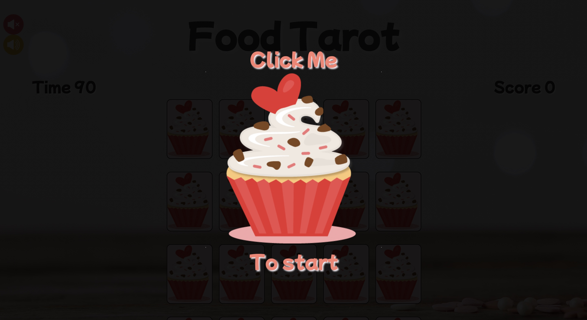
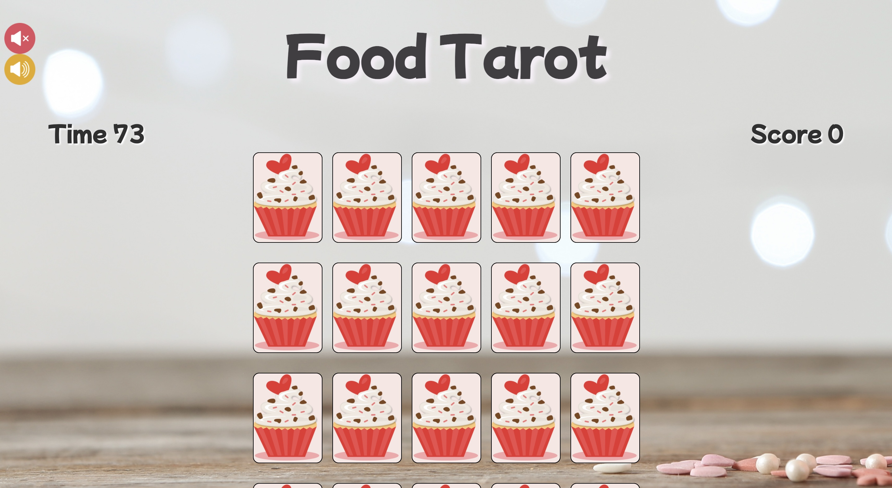
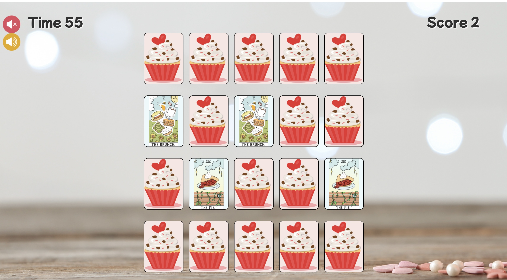
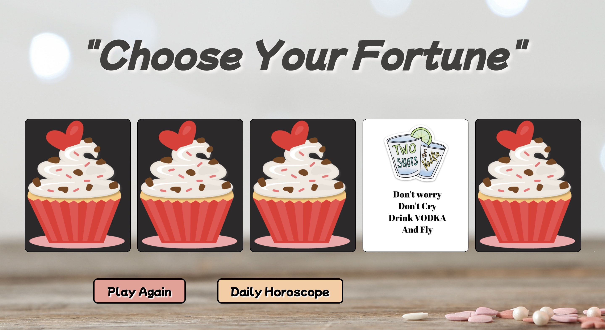
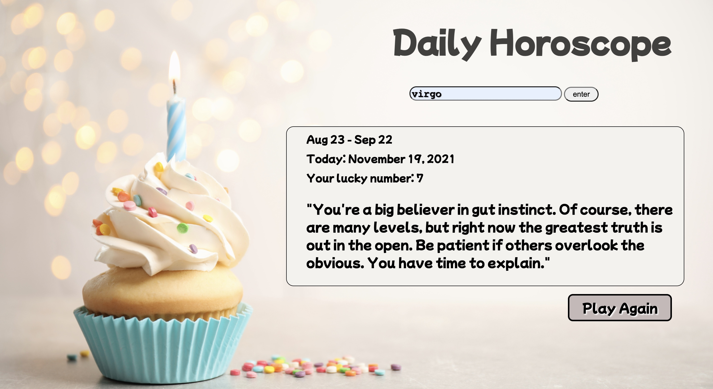
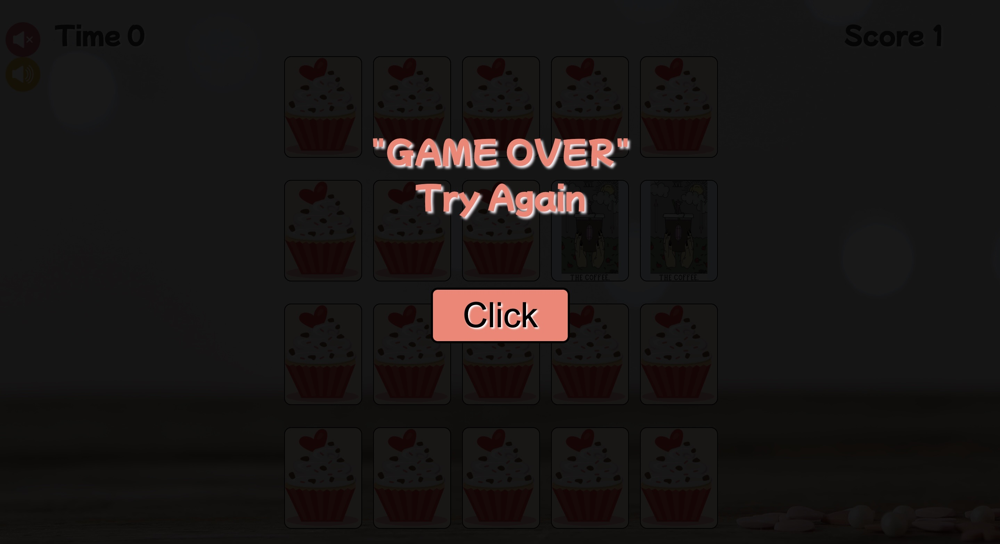
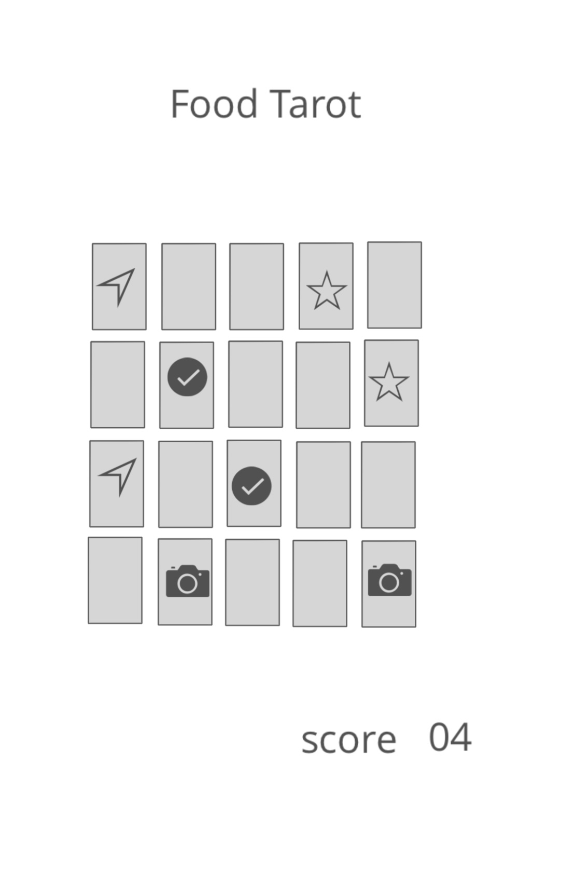

## Description
My flash card game is about Food Tarots. There are 10 pairs of food cards. Player has to match all 10 pairs to win the game. Bonus after wining, player can pick cards for some fun food fortune. and can also check daily horoscope.

- Click the page to start game.




- Play by matching 10 pairs of cards within 90 sec.





- After matching all cards, will have bonus page to choose the fun food fortune card and page to review daily horoscope.





- If the remaining time ran out, will have to try again.




## Built With
- [HTML](#html)
- [CSS](#css)
- [JavaScript](#javascript)

## Installation instructions
1. Get a free API Key.
2. Clone the repo.
`git clone https://github.com/your_username_/Food-Tarot`
3. Enter your API in config.js
````javascript
    const myApiKey = 'ENTER YOUR API KEY';
````

## User Story
User can be anyone who enjoy matching game.

- As a user, User should be able to start the game of matching 10 pairs of card.
- As a user, User should be able to click to flip the card and find the match.
- As a user, User should hear the sound alerts if the card are matched and they will stay filpped.
- As a user, User should see the score updates every time that the pair is matched.
- As a user, User win the game when matched 10 pairs of cards.
- As a user, If the time running out, will have to try again.

After winning

- As a user, User can pick cards to see the fun food fortunes.
- As a user, User can check daily Horoscope.

## Wire Frames


## Unsolved Problems and Major Hurdles
- I was spending most of time on shuffling the card so I have to do a lot of research and learn from there.
- My mute button is only work on the background music. Which I also want to leave the sound effect for the alert. But technically I couldn't make it all to mute at the same time so I have to do it that way.


